## CDSW Installation On Cloud

This project is derived from the fantastic work done by TobyFergusion (https://github.com/tobyHFerguson). Toby wrote an extensive document on how to install CDSW early on. The document is quite technical and provides extensive coverage into how CDSW is to be installed. I aim to extend that and perhaps simply certain steps, highlight a few gotchas that I encountered in the process. 

The aim of this following document is to simply the creation and deployment of the CDSW cluster (including kerberos) on Cloud Platforms (AWS, Azure and GCP) using Cloudera Director. 

The approach for deployment remains largely the same so with minor changes, you would have flexibility to change and deploy CDSW on any of the Cloud platforms. **Note for this document, I've current done extensive testing with AWS. I will update the Azure and GCP segment and configuration in the coming weeks as well.  

The total duration of the build would be around an hour end-to-end and I have made some edits in the scripts to automate certain steps which were previously manual. 

## Pre-Requsities

Needless to say, before you start you must have access to respective cloud platform with adequate credits to deploy CDSW/CDH Cluster. At the very minimum, we will deploy (3+1+1+3) nodes of various shapes, so this may need adequate credits based on the shape that you use. 

Our basic workflow would be as follows:

* Deploy a single EC2 instance and configure Diretor 2.8 (This is the current tested release. Going forward, I will update this document to include Altus Director v6.1)
* Download this github repo on to your local system
* Update the required configuration settings, property files. that reflect your enviroment
* Add the necessary SECRET and ssh key files
* Upload all the necessary configuration files needed for Director to create a deployment (All the files in this github repo)
* Execute the Bootstrap from Director
* Test and Validate

**Other Tools**

* Putty/Terminal for ssh
* Textedit or Textwrangler for editing property files

## Instance Shapes / Cost

For the deployment, I would be using the following shapes in AWS:

* Director 	( 4CPU, 16 GB RAM) 		- m4.xlarge (xx/hr)
* CDH Master 	( 4CPU, 16 GB RAM) 		- m4.xlarge (xx/hr)
* CDH Workers	( 4CPU, 16 GB RAM)		- m4.xlarge (xx/hr)
* CDSW Master	(16CPU, 64 GB RAM)		- m4.xlarge (xx/hr)
* CDSW Worker	(16CPU, 64 GB RAM)		- m4.xlarge (xx/hr)

For all instances, I will be using the following AMI - ```ami-78485818```
All instances will be launched in the region : ```us-west-1``` which is also the cheapest option based on instance cost.

## Step 1: Director Step

For this segment, to demonstrate, I will leverage AWS to deploy this cluster. Let's provision an instance, and deploy director. For director setup, you can simply execute the script install_director.sh. This does not require any changes/edits and will deploy Director. I've added a few screenshots below to highlight some of the crucial steps. 

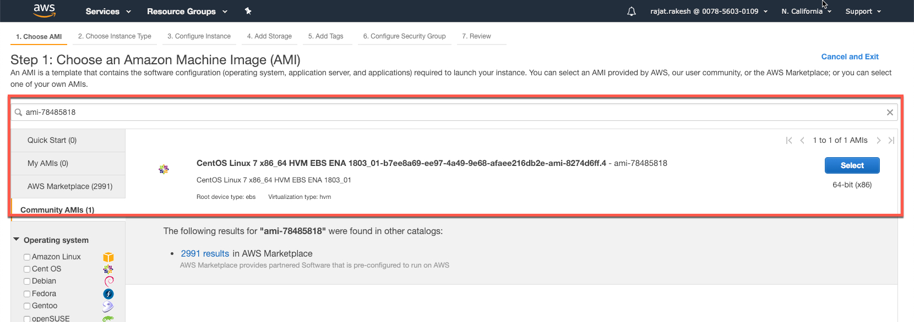

Goto the EC2 screen and launch an instance in the ```us-west-1``` region for the ```ami-78485818```. 

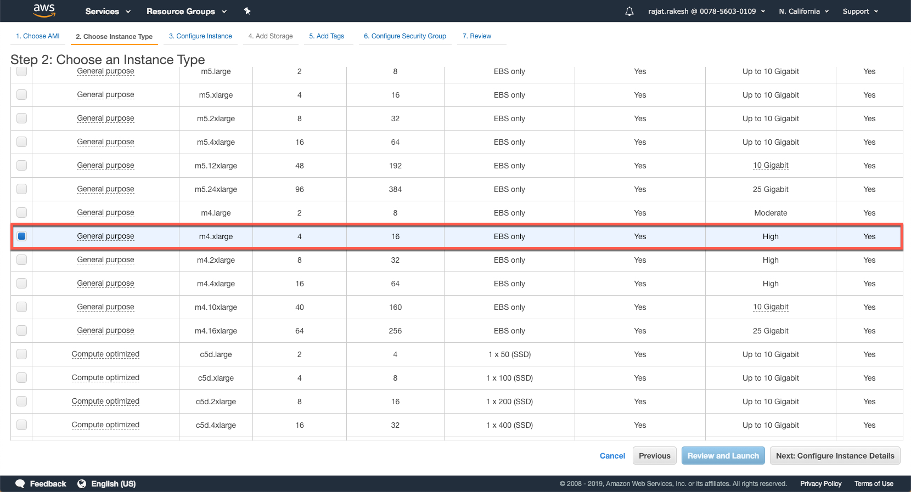

At the very minimum, select the ```m4.xlarge``` shape (4CPU, 16 GB RAM) instance. 

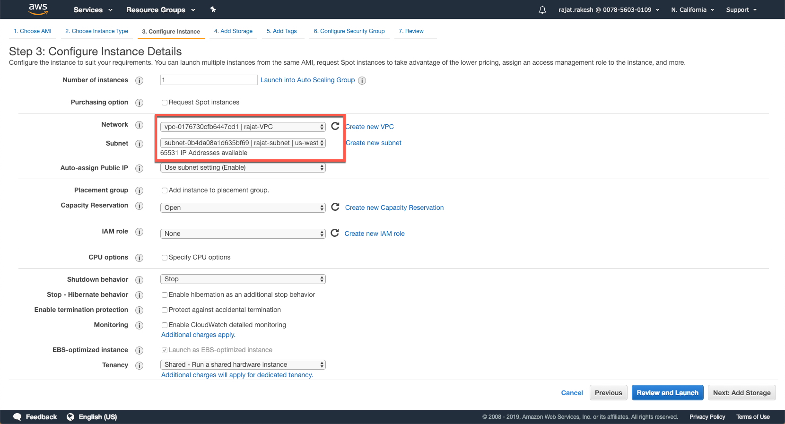

In this screen, select the VPC that you may have created before to launch this instance. If you don't have a VPC yet, then you can create one at this stage. 

 

Increase the size of the disk from 8 GB to 40 GB and select the 'Delete on Termination' Flag. This will ensure that any volumes attached to this instances are also deleted when this instance is terminated. 

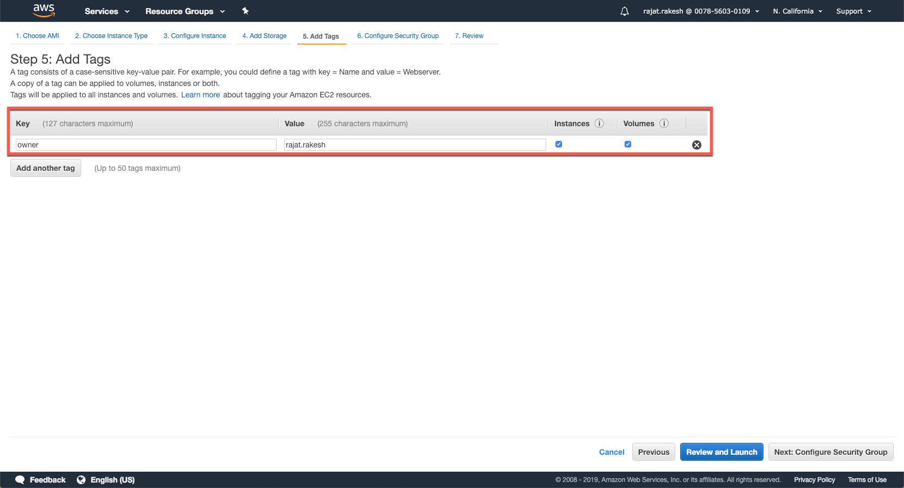

Configure any tags that you may want to assign to your instance. These are quite handy esp. if you are using a shared environment where multiple instances are being run by other users and if you want to filter the ones that you have quickly. 

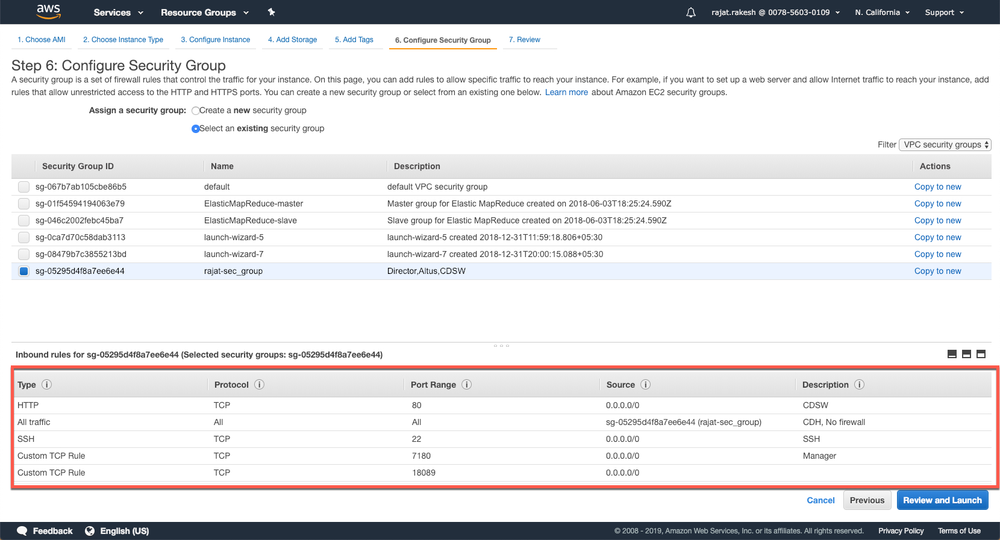

In this screen, you need to setup the security groups and open the necessary ports. AWS instances would not allow inbound access to to the specific ports required if access is not explictly enabled. 

The ports that need to be opened are as follows:

* 22 - SSH
* 80 - CDSW
* 7180 - Cloudera Manager
* 7189 - Cloudera Director

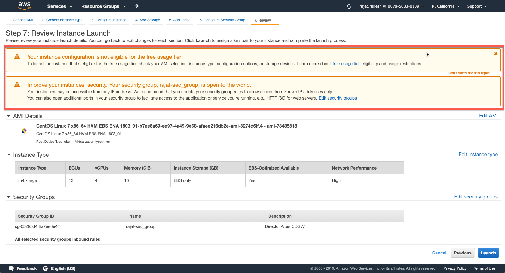
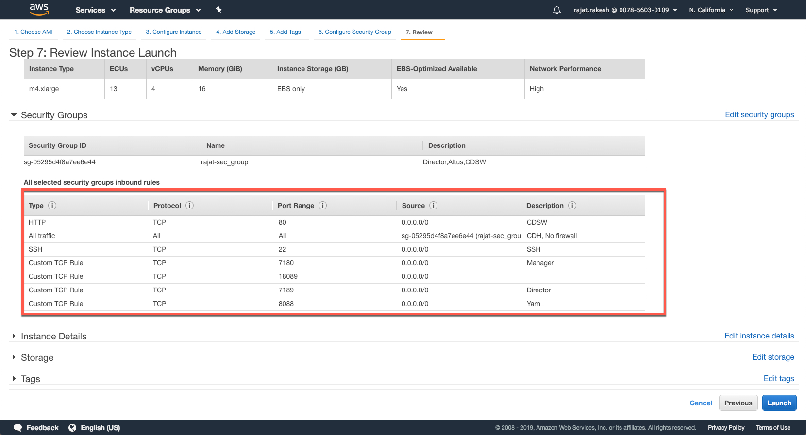
 
Finally, review and launch your instance. Note the warning that credits (paid) would be consumed in your account for the duration this instance runs. 

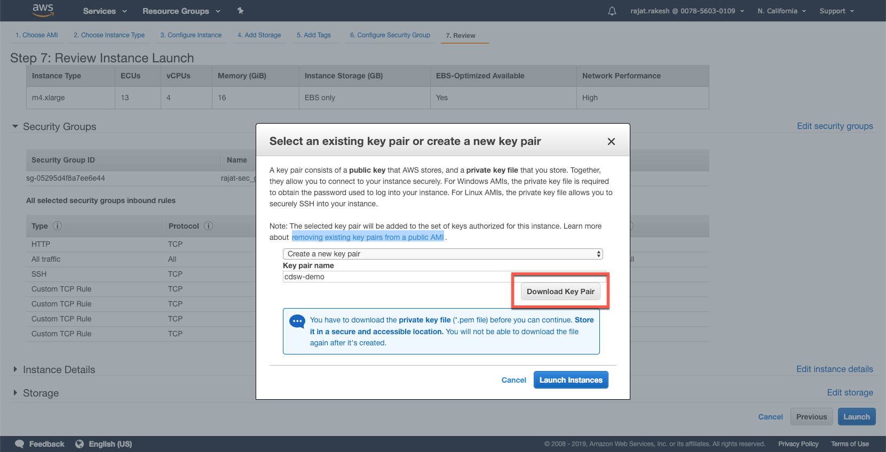

The last step is to select a key pair (if one exists in your account). You can also create a key pair and assign it to your instance in this screen. Please do remember to download the key paid once you have created it. This is the time when you would be able to download the key pair after creating it. This private key would be required for you to ssh into your vm instance. 

## Configuration Files & Project Structure

There are a number of configuration files that are required and needed for this setup:

		/
		-->common.conf
		-->aws.conf
		-->install_director.sh
		-->install_mit_kdc.sh
		-->install_mit_client.sh
		/aws
		-->aws.conf
		-->cluster.configs.HDFS.core_site_safety_valve.conf
		-->instances.conf
		-->kerberos.properties
		-->provider.conf
		-->provider.properties
		-->ssh.properties
		-->SECRET.properties
		-->**public key**
		-->**private key**
		/scripts
		-->cdsw_postcreate.sh
		-->cdswmaster-bootstrap-script.sh
		-->clean-yum-cache.sh
		-->java8-bootstrap-script.sh
		-->jdk_security.sh
		-->kerberos_client.sh
		-->ntpd.sh
		-->users.sh

We will first go through all the configuration files in brief, and make the changes that are required for the setup. **The current script has all the defaults pre-setup and doesn't require any changes, unless specifically required.** 

## common.conf

This is an imporant configuration file and might require a few changes. This configuration file captures the following:

* Cluster Name
* ssh credentials (used for accessing other nodes by Cloudera Manager)
* Cloudera Manager Configuration (including for Kereberization)
* Parcel Locations for CDSW, Spark2 On Yarn, Cloudera Manager, CDH, Anaconda
* Roles that will be installed on CDH (HDFS, YARN, CDSW, SPARK2_ON_YARN, HIVE, OOZIE, IMPALA & HUE)
* Parameterized Variables for # of instances and instance types that will be setup for CDH Master & Worker, CDSW Master and Worker Nodes
* Location of post create/bootstrap scripts that need to be executed

Since this file has been largely parameterized, there are not many changes required here, unless you need to change the version of CDH, or if you get any errors on parcel locations or a specific version not be found

**Update 14th Jan, 2019**
There were some errors that I encountererd with Anaconda 5.0.1 not being available so I have made changes so that it now looks for 5.1.0.1

The following version are installed:
CDH: 5-14
SPARK: 2.2.0.cloudera2
Anaconda: 5.0.1
CDSW: 1.4.0.p1.431664

**Update 16 Jan, 2019** I have updated this to reflect the new parcel location for Anaconda. Per our [documentation](https://www.cloudera.com/documentation/data-science-workbench/latest/topics/cdsw_requirements_supported_versions.html), Cloudera Data Science only supports Anaconda 5.0.1, which ships Python 2.7. Newer version of Anconda do not ship Python 2.

## aws.conf
This file just has links for the main conf files in the /aws folder. **No changes required**

## /aws/aws.conf
Serves as an include file. **No Changes Required**

## /aws/cluster.configs.HDFS.core_site_safety_valve.conf
A few standard configuration setting on block size etc. **No changes required**

## /aws/instances.conf
This file has the instance configuration options for CDH Master & Worker Nodes, CDSW Master & Worker Nodes. 

All the settings have been parameterized, so you can configure them from provider.properties. This file configures the intance type, instance name for CDH and additional properties such as rootVolumeSize, ebsVolumes for cdsw master and workers. For the most bit, you wouldn't need to tinker with this file much.

## /aws/kerberos.properties
This is an important file, and relevant ONLY IF you are kerberizing your cluster. If you don't want kerberization, simply remove this file from your folder before you upload the diretory to the director instance. If you are looking to bring up a test cluster with CDSW, no changes required. 

SECURITY_REALM:
HADOOPSECURITY.LOCAL

Users:
cm/admin@HADOOPSECURITY.LOCAL
cdsw@HADOOPSECURITY.LOCAL

KDC_HOST_IP: 0.0.0.0

ote that its the /ip address/ that you should use
  here because of a CDSW/Kubernetes defect: [[https://jira.cloudera.com/browse/DSE-1796][DSE-1796]]

## /aws/provider.conf
Sets up aws properties in variables (accessKeyId etc.) **No changes required**

## /aws/provider.properties
This is an important file as various defaults are configured in this file. The important ones being as follows. **REMEMBER TO UPDATE** the accesskeyid and other fields before you deploy. 

		AMI_ID=ami-78485818
		AWS_ACCESS_KEY_ID=##Your AWS Key##
		AWS_REGION=us-west-1
		OWNER=rajat
		SECURITY_GROUP_ID=##Your Security Group ID##
		SUBNET_ID=##Your subnet ID##
		CDHMASTER_INSTANCE=c4.2xlarge
		CDHWORKER_INSTANCE=c4.4xlarge
		CDHWORKER_NODECOUNT=3
		CDSWWORKER_INSTANCE=c4.4xlarge
		CDSWMASTER_INSTANCE=c4.4xlarge
		CDSWWORKER_NODECOUNT=2
		YARN_RAM=4096
		YARN_VCORES=2
		NAME_PREFIX=rajat
		
Make sure you provide adequate nodes for CDH and CDSW workers as well as the appropriate shape for the instances. I typically assign larger shapes to CDSW Master and Workers (c4.8xlarge) for workshops. 

## SECRET.properties
You need to create this file in the same folder. For some reason, Github does not let me upload this file, perhaps due to the name. This file would have only one field. **Be mindful if you maintain your files on github; This file being shared publicly (and AWS ACCESS KEY) may give others access to your aws account.**

		AWS_SECRET_ACCESS_KEY=##Your AWS Key##

## /aws/ssh.properties
This file just has the default ssh username. In our case, that is ```centos```.You would also need to update the field:

		SSH_PRIVATEKEY=aws/cdsw-admin
		
Before you upload the zip file (having all properties files, scripts as mentioned in the steps below), please ensure that your public key and private key files are available in the ```/aws``` folder.
 
Your /aws folder should have the following files:

 

## Public and Private Keys
When you launched the Director instance in the above steps, there was a step to download the .pem file. 

Make sure that you have the name of the file properly referenced in the property file above (ssh.properties). The private key needs to be in the /aws folder as well. 

For the public key, we need to connect to the instance and download the file. Let's open an ssh session to the terminal. Before this, make sure that you have changed the permission on the .pem file. In my case, the name of my private key attached to the instance is cdsw-demo.pem:

	sudo chmod 600 cdsw-demo.pem

Open the session and locate the public key. It would be in the folder ~/.ssh:
	
	ssh -i cdsw-demo.pem centos@54.183.236.130
	cd ~/.ssh
	ls 
	authorized_keys
	
Run cat to copy the contents and save on your local machine as cdsw-demo.pub
	
	cat authorized_keys 
	ssh-rsa AAAAB3NzaC1yc2EAAAADAQABAAABAQClbj5MLoHGkDo2vmRsWbyCpxYb1i4L3e9Zj
	YufG2CLYSm0duMRs5OeCQdiNOmSkMPY7S79lMgijUDtwb/98buRMWuI6F9qFTk5ij7HJY70mI9jJcZfCoUQGJ79ktmVc4AcliUjXql4ig5KuAfchJlNxGX
	+43+KI4KTLHjXK46uwyOagGZCs/a3cv6Q3cHob1cKShCS4EB*******************************************
	
## Last Checks / Tips

Once you have downloaded the public and private keys, I would recommend copying them to your local ~/.ssh folder so that you are able to do a password-less sudo to the AWS instance. 

As a practice, I keep both my public and private keys in this folder. You may also want to update the config file and add the entry to your director instance, to make it easier to connect. 

The entry would look like:

	host aws-demo-director
		hostname ec2-13-57-227-102.us-west-1.compute.amazonaws.com
		user centos
		identityFile ~/.ssh/cdsw-demo
		
After this, you can simply connect by:

	ssh centos@aws-demo-director

Make sure the .sh file have execute permissions, before you zip and upload to the instance. 

	sudo chmod 777 install_*.sh
	
Now we are ready to upload all folder with all the necessary config files and scripts to the Director instance. 

In my case, all my files are in the ```cdsw-demo``` directory. The following commands with create a tar file of contents of the folder, upload it to the director instance and unzip it into the /home/centos/ folder. 

	cd cdsw-demo
	T=/tmp/cdsw.tar
	tar cf $T . && scp $T aws-demo-director:$T && ssh aws-demo-director tar xf $T


## Director Installation

Now we can start the Director installation by executing the install_director.sh script. 

	$./install-director.sh

It would download and setup director. Once everything is complete, you would see the following (<15 mins):

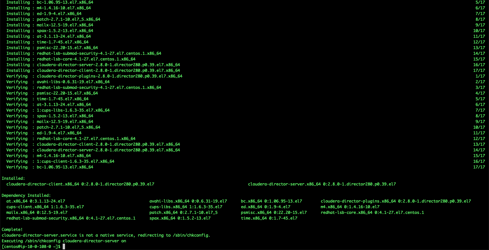

We can validate whether Director is successfully installed. Copy the public IP from AWS EC2 console. Director is accessible on port **7189**. If you have issues accesing this, check if you have configured your security group properly and that inbound port 7189 is open. 

You should be able to see the following screen:

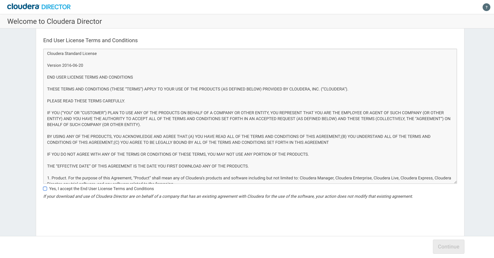

For the purpose of this setup, we actually don't need to access Director through the console, but we will click "Accept the Terms and Conditions" and just goto the next screen. 

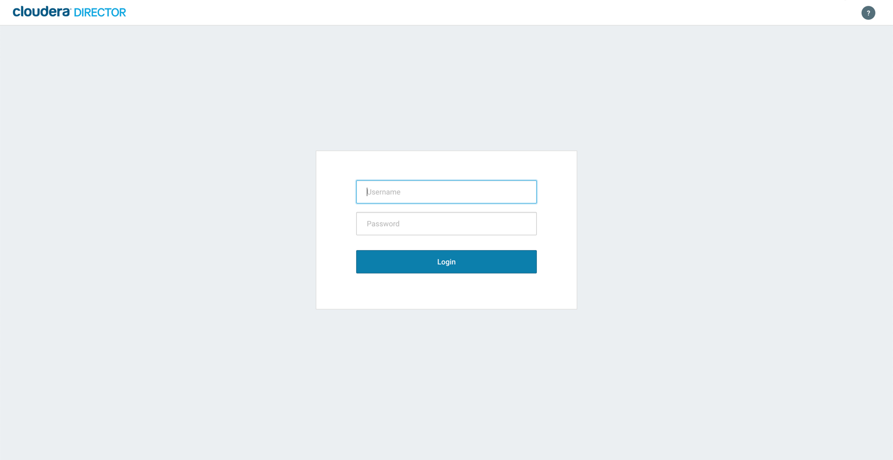

**Tip** There are times where I have noticed that on accessing the web console for Director tends to mess up my director bootstrap option. Also, if for any reason, the bootstrap fails mid way, then I would suggest re-doing the installation for Director. I've usually found that to be a quicker option, than to debug. 

## KDC Installation:

With Director up and running, let's setup KDC on this instance as well. We would re-using the director instance for this, hence the Director instance needs to be operational the entire time, even after the cluster has been brought up. 

The script to install KDC, should also be available in the /home/centos folder. Execute the ./install_mit_kdc.sh. Since this needs root access, so execute as follows:

	sudo ./install_mit_kdc.sh

The installation should be quick, and once installed you should see two principal accounts created. 

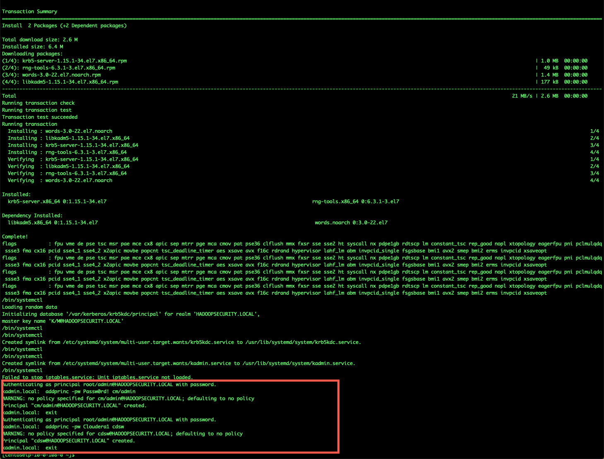

To test, you can setup the kdc client and test that the cdsw principal through the client. The client can be set by executing the following:
	
	sudo ./install_mit_client.sh $(hostname -I)
	
Once the installation is complete, we can test the prinicpal cdsw@HADOOPSECURITY.LOCAL [Password: Cloudera1] by executing the following. If there are any errors, it will report on the screen. No response means that the validation of the principal and password is successful. 

	kinit cdsw@HADOOPSECURITY.LOCAL
	
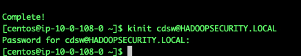

The last step now is to change the ```KDC_HOST_IP``` variable in the ```./aws/kerberos.properties``` file. You can identify the internal ip of the KDC Host by:

	$hostname -I
	10.0.108.0
	
Copy and replace this in the kerberos.properties. After this step, the only thing left to do is to run the director bootstrap. 

The director bootstrap needs to be executed in /home/centos/ and **NOT** in the /aws folder where all the configuration files are. 

	cloudera-director bootstrap-remote aws.conf --lp.remote.username=admin --lp.remote.password=admin
	
The installation will begin, and you would see something like this:

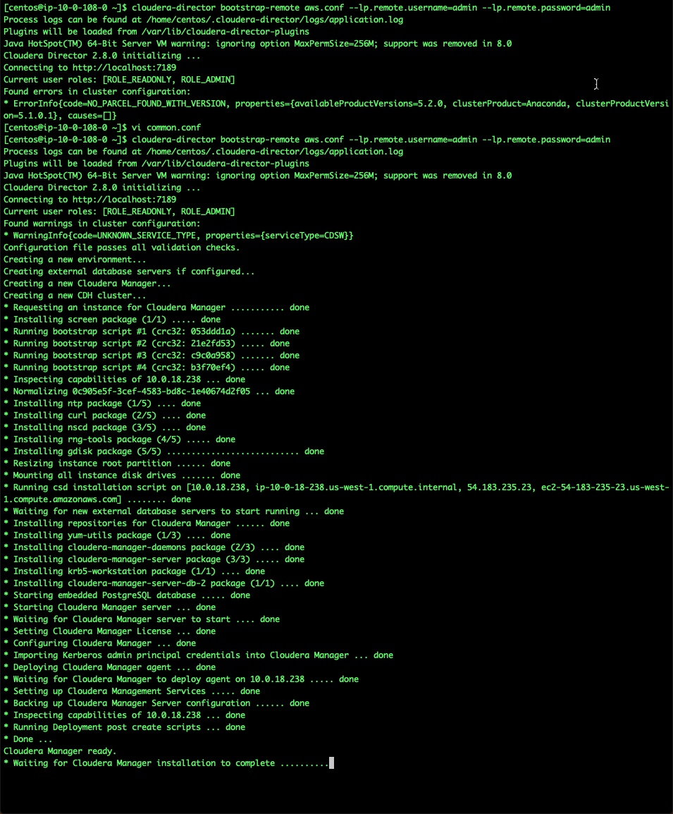


	

	


	


	

	
	


  

